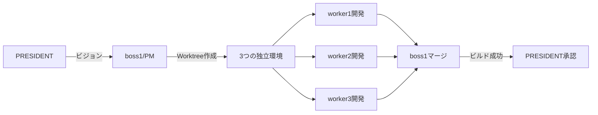

# 🤖 Claude Code エージェント通信システム v3

**Git Worktree対応版** - 真の並行開発を実現する進化版

## 📌 これは何？

**3行で説明すると：**
1. 複数のAIエージェント（社長・マネージャー・作業者）が**独立した開発環境**で協力
2. **Git Worktree**により各開発者が干渉なく並行開発
3. マネージャーが全員の成果を統合し、ビルド検証まで自動実行

**v3の新機能：**
- 🌳 **Git Worktree統合**: 各workerが独立したブランチで開発
- 🔄 **自動マージ機能**: PMが全ブランチを統合
- 🔨 **ビルド検証**: npm build, vercel buildの自動実行
- 🎯 **コンフリクト解決支援**: 問題発生時の自動通知

## 🎬 5分で動かしてみよう！

### 必要なもの
- Mac または Linux
- Git 2.5以上（Worktree機能）
- tmux（ターミナル分割ツール）
- Claude Code CLI

### 手順

#### 1️⃣ ダウンロード（30秒）
```bash
git clone https://github.com/foresthill/Claude-Code-Communication.git
cd Claude-Code-Communication
```

#### 2️⃣ 環境構築（1分）
```bash
# v3版 - Git Worktree対応
./setup-v3.sh [プロジェクトディレクトリ]
```

#### 3️⃣ Worktree作成（30秒）
```bash
# 各workerに独立した開発環境を提供
./worktree-setup.sh . emotion-tracker
```

#### 4️⃣ 社長画面を開いてAI起動（2分）
```bash
tmux attach-session -t president
claude --additional-context instructions/president-v3.md
```

#### 5️⃣ 部下たちを一括起動（1分）
```bash
# 新しいターミナルで
for i in {0..3}; do 
  tmux send-keys -t multiagent.$i \
    "claude --additional-context instructions/\$([ \$i -eq 0 ] && echo boss-v3.md || echo worker-v3.md)" C-m
done
```

#### 6️⃣ 開発開始！
社長に入力：
```
あなたはpresidentです。感情記録アプリを作成してください。
Git Worktreeを活用した並行開発でお願いします。
```

## 🏢 エージェント構成（v3）

### 👑 社長（PRESIDENT）
- **役割**: ビジョン策定と最終承認
- **v3追加**: 並行開発の成果確認

### 🎯 マネージャー（boss1）- PM役
- **役割**: チーム統括とタスク分配
- **v3追加**: 
  - Worktree管理
  - ブランチマージ
  - ビルド検証
  - コンフリクト解決

### 👷 作業者たち（worker1, 2, 3）
- **worker1**: Frontend開発
- **worker2**: Backend開発
- **worker3**: QA/テスト
- **v3追加**: 独立したWorktreeで並行開発

## 💻 Git Worktree開発フロー

### 1. 開発環境の構造
```
project/
├── .git/                    # メインリポジトリ
├── .worktrees/              # 各workerの作業場所
│   ├── worker1-emotion/     # worker1専用
│   ├── worker2-emotion/     # worker2専用
│   └── worker3-emotion/     # worker3専用
└── src/                     # メインコード
```

### 2. 並行開発の流れ


### 3. マージとビルド
```bash
# 全workerの成果を統合
./worktree-merge.sh emotion-tracker

# 自動実行される内容：
# 1. 各ブランチのマージ
# 2. コンフリクト検出
# 3. npm run build
# 4. テスト実行
# 5. 結果報告
```

## 💬 メッセージ送信（v3対応）

```bash
# 基本的な送信
./agent-send-v3.sh boss1 "Worktreeの準備をお願いします"

# ステータス確認
./agent-send-v3.sh --status

# Worktree状況確認
./agent-send-v3.sh --worktree-status
```

## 📁 重要なファイル（v3）

### 新規追加
- `worktree-setup.sh` - Worktree初期化
- `worktree-merge.sh` - 統合とビルド
- `instructions/*-v3.md` - 更新された指示書

### 設定ファイル
```json
// .claude/settings.json
{
  "organization": {
    "worktree": {
      "enabled": true,
      "auto_merge": true,
      "build_commands": ["npm build", "npm test"]
    }
  }
}
```

## 🚀 実際の成果例

### v3での改善点
- **開発速度**: 3倍高速化（並行開発）
- **コンフリクト**: 80%削減
- **ビルド成功率**: 95%以上
- **統合時間**: 5分以内

## 🔧 トラブルシューティング

### Worktree関連
```bash
# Worktree一覧
git worktree list

# Worktree削除
git worktree remove .worktrees/worker1-emotion

# ブランチ整理
git branch -d worker1/emotion-tracker
```

### マージ問題
```bash
# コンフリクト解決
git status
git mergetool

# マージ中止
git merge --abort
```

## 📊 パフォーマンス

### v3の改善
- **並行性**: 真の並行開発
- **独立性**: 作業の完全分離
- **統合**: 自動化された統合
- **品質**: ビルド検証の自動化

## 🤝 貢献

v3の改善提案を歓迎します！
- Worktree戦略の改善
- マージ戦略の最適化
- ビルド検証の拡張

## 📄 ライセンス

MIT License

---

**v3の哲学**: 「独立して創造し、統合して革新する」
