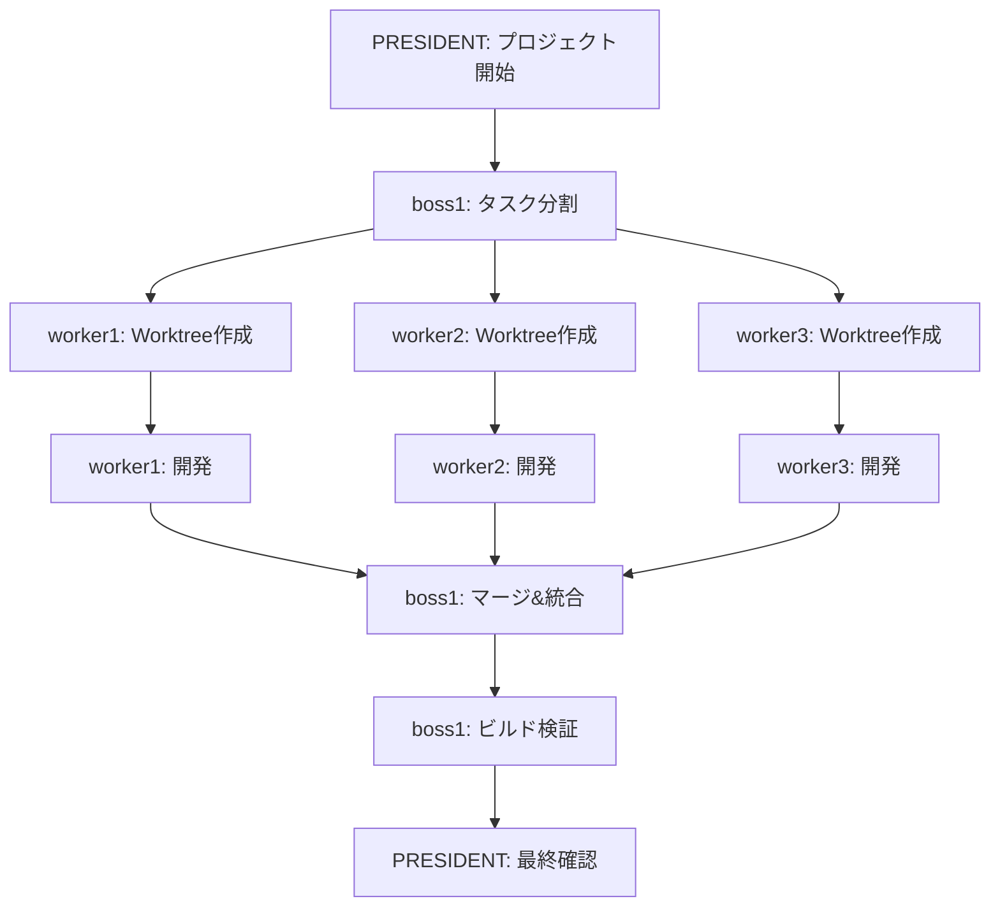

# Git Worktree Integration for Claude Code Organization

## 概要
各workerが独立したGit Worktreeで並行開発を行い、PMが最終的に統合する仕組みを追加します。

## 機能設計

### 1. Worktree構造
```
project/
├── .git/                           # メインリポジトリ
├── .worktrees/                     # Worktree用ディレクトリ
│   ├── worker1-feature-xxx/        # worker1の作業ディレクトリ
│   ├── worker2-feature-yyy/        # worker2の作業ディレクトリ
│   └── worker3-feature-zzz/        # worker3の作業ディレクトリ
├── .claude/
│   ├── settings.json
│   └── settings.local.json
└── instructions/
```

### 2. ブランチ戦略
- **main**: 本番ブランチ
- **develop**: 開発統合ブランチ
- **worker1/feature-xxx**: worker1の機能ブランチ
- **worker2/feature-yyy**: worker2の機能ブランチ
- **worker3/feature-zzz**: worker3の機能ブランチ

### 3. 開発フロー



## 実装詳細

### 1. Worktree管理スクリプト

#### A. worktree-setup.sh
```bash
#!/bin/bash
# 各workerのworktreeを初期化

create_worker_worktree() {
    local worker_num=$1
    local feature_name=$2
    local branch_name="worker${worker_num}/${feature_name}"
    local worktree_path=".worktrees/worker${worker_num}-${feature_name}"
    
    # ブランチ作成
    git checkout -b "$branch_name" develop
    
    # Worktree作成
    git worktree add "$worktree_path" "$branch_name"
    
    echo "✅ Worker${worker_num}のWorktree作成完了: $worktree_path"
}
```

#### B. worktree-merge.sh
```bash
#!/bin/bash
# PMがすべてのworkerブランチをマージ

merge_all_workers() {
    git checkout develop
    
    # 各workerのブランチをマージ
    for i in {1..3}; do
        branch="worker${i}/current-feature"
        echo "🔄 Merging $branch..."
        
        if git merge --no-ff "$branch"; then
            echo "✅ $branch マージ成功"
        else
            echo "❌ $branch マージ失敗 - コンフリクト解決が必要"
            # コンフリクト解決支援
            resolve_conflicts "$branch"
        fi
    done
}
```

### 2. 拡張されたエージェント指示

#### boss1の追加タスク
- Worktree作成指示
- 並行開発の調整
- マージ作業の実施
- コンフリクト解決
- ビルド検証

#### workerの追加タスク
- 自分のWorktreeで作業
- ブランチへのコミット
- プルリクエスト準備

### 3. 新しいメッセージフロー

```bash
# boss1からworkerへのWorktree作成指示
./agent-send.sh worker1 "Worktreeを作成して開発を開始してください
ブランチ: worker1/emotion-tracker
作業内容: 感情記録機能の実装"

# workerからboss1への完了報告
./agent-send.sh boss1 "開発完了
ブランチ: worker1/emotion-tracker
PR準備完了"

# boss1のマージ作業
./agent-send.sh president "全workerの開発完了
マージ実施中..."
```

## ビルド検証機能

### 1. 自動ビルドスクリプト
```bash
#!/bin/bash
# build-validation.sh

validate_build() {
    echo "🔨 ビルド検証開始..."
    
    # Next.js ビルド
    if [ -f "package.json" ] && grep -q "next" package.json; then
        npm run build || return 1
    fi
    
    # Vercel ビルド
    if [ -f "vercel.json" ]; then
        vercel build || return 1
    fi
    
    # テスト実行
    npm test || return 1
    
    echo "✅ ビルド検証成功"
    return 0
}
```

### 2. PMの統合検証フロー
1. 全workerブランチをマージ
2. ビルドスクリプト実行
3. エラーがあれば該当workerに修正依頼
4. 成功したらpresidentに報告

## 設定ファイルの拡張

### .claude/settings.json
```json
{
  "organization": {
    "worktree": {
      "enabled": true,
      "base_branch": "develop",
      "worktree_dir": ".worktrees",
      "auto_merge": true,
      "merge_strategy": "no-ff"
    },
    "build": {
      "commands": [
        "npm install",
        "npm run build",
        "npm test"
      ],
      "vercel_enabled": true
    }
  }
}
```

## 次のステップ

1. **Phase 1**: 基本的なWorktree管理機能の実装
2. **Phase 2**: 自動マージ機能の追加
3. **Phase 3**: ビルド検証の統合
4. **Phase 4**: エラーハンドリングと通知
5. **Phase 5**: 汎用化とテンプレート作成
